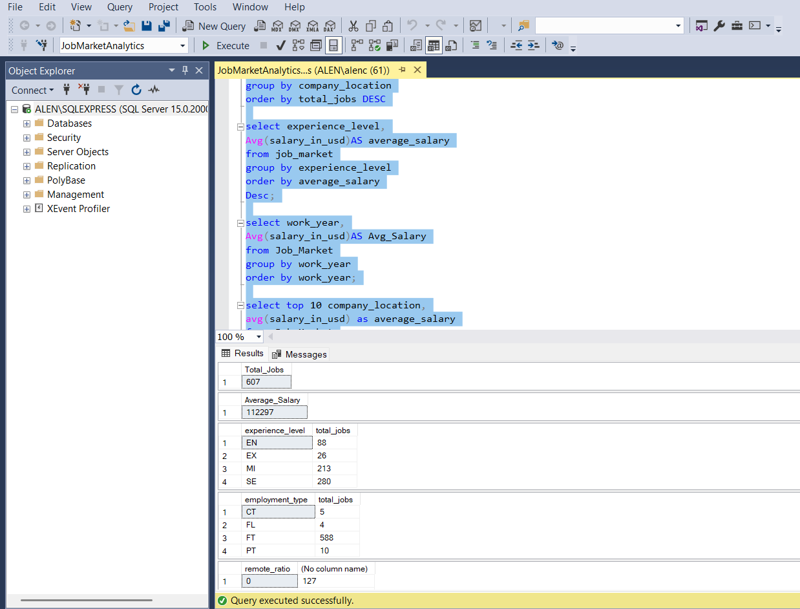
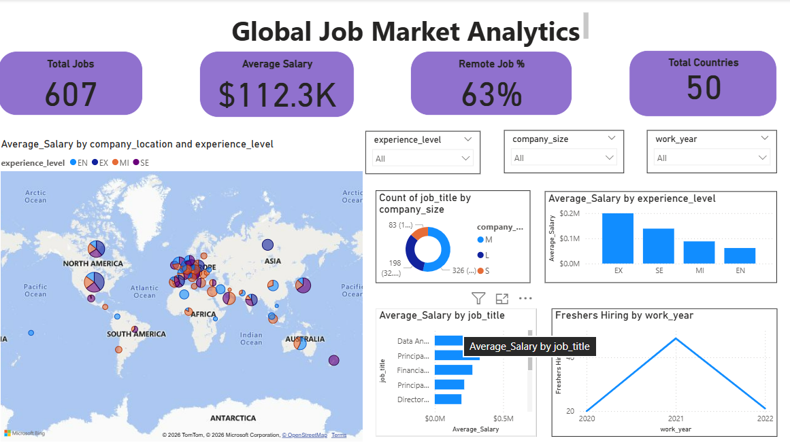

# Job Market Analysis

## 📌 Project Overview
This project analyzes job market trends using Python, SQL, Machine Learning, and Power BI. It explores salary patterns, experience levels, employment types, remote work trends, and job demand to generate actionable insights. Machine learning models were developed to predict salaries, while Power BI dashboards provide interactive business insights.

---

## 🎯 Objectives
- Analyze global job market trends.
- Explore salary distribution across job roles and experience levels.
- Perform SQL-based data analysis to answer business questions.
- Build machine learning models for salary prediction.
- Create interactive Power BI dashboards for data visualization.

---

## 🛠️ Technologies Used
- Python
- Pandas
- NumPy
- Matplotlib
- Seaborn
- Scikit-learn
- SQL
- Power BI
- Jupyter Notebook

---

## 🤖 Machine Learning Models
- Decision Tree Regressor
- Random Forest Regressor

---

## 🗄️ SQL Analysis

SQL was used to answer key business questions, including:
- Average salary by experience level
- Highest-paying job titles
- Salary comparison across employment types
- Company location and employee residence analysis
- Remote work distribution
- Data filtering, grouping, sorting, and aggregation

### SQL Query Preview



---

## 📊 Power BI Dashboard

An interactive Power BI dashboard was created to visualize:
- Salary distribution
- Experience level analysis
- Job title insights
- Remote work trends
- Employment type comparison
- Country-wise job market insights

### Dashboard Preview



---

## 📂 Project Files
- `Job_Market_Analysis.ipynb`
- `ds_salaries.csv`
- `Job_Market_Dashboard.pbix`
- `dashboard.png`
- `sql_query.png`
- `requirements.txt`

---

## 📈 Key Insights
- Performed exploratory data analysis (EDA).
- Identified salary trends across experience levels and job roles.
- Built Decision Tree and Random Forest regression models for salary prediction.
- Queried data using SQL to answer business questions.
- Designed an interactive Power BI dashboard to communicate findings effectively.

---

## 📦 Requirements

```text
pandas
numpy
matplotlib
seaborn
scikit-learn
```

---

## 🚀 How to Run
1. Clone this repository.
2. Install the required libraries:
   ```bash
   pip install -r requirements.txt
   ```
3. Open the Jupyter Notebook and run all cells.
4. Open the `.pbix` file in Power BI Desktop to explore the dashboard.

---

## 👨‍💻 Author

**Alen C Alex**

AI & Data Science Graduate | Data Analyst | Machine Learning | SQL | Power BI | Python
